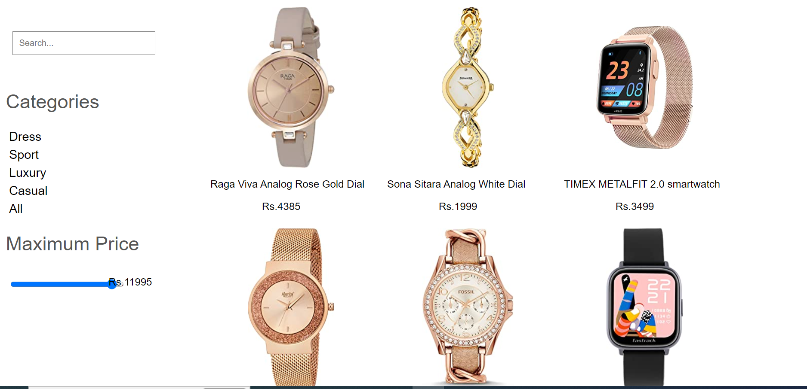

# **Watch App**

A watch app built using React, TypeScript, hooks, the Context API, and the filter method that allows users to search watches. The app would use React for its component-based structure and TypeScript for type checking. Hooks would be used for state management and the Context API would be used to share data between components. The filter method would be used to filter category, price and search input.

### Trainer target

- Typescript
- Learn to implement hooks like useState, useEffect()
- Filter method
- context API

## Tech stack

### _Language_: Javascript, Html, Css, Typescript

### _Package management_: NPM

### _Frameworks_/ _Library_: React

## Trainee Achieved

- using hooks
- Typescript
- learn Context API
